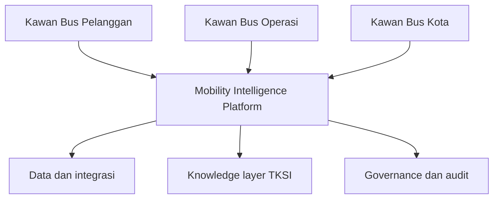
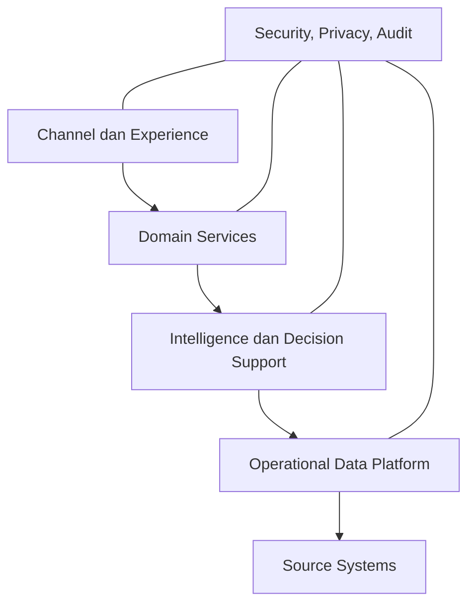
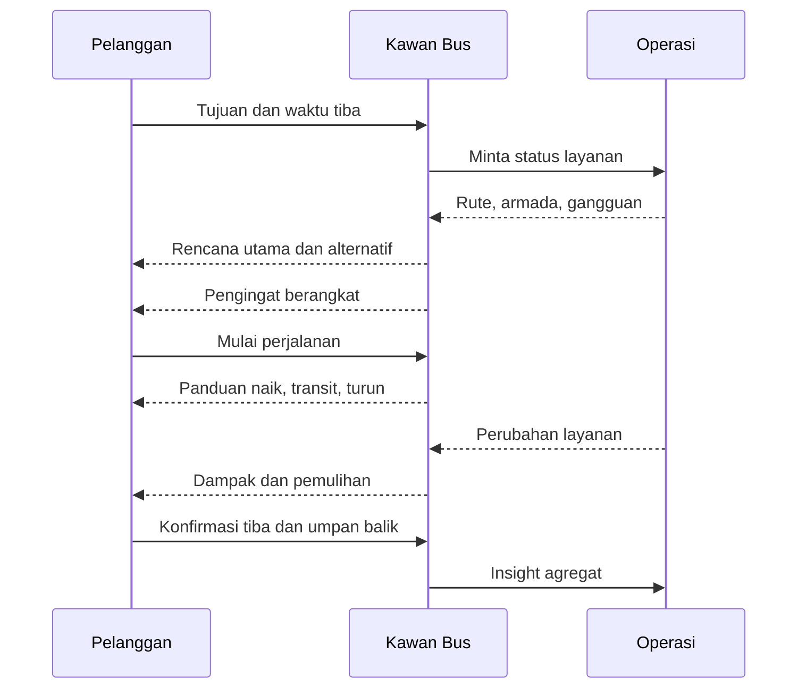
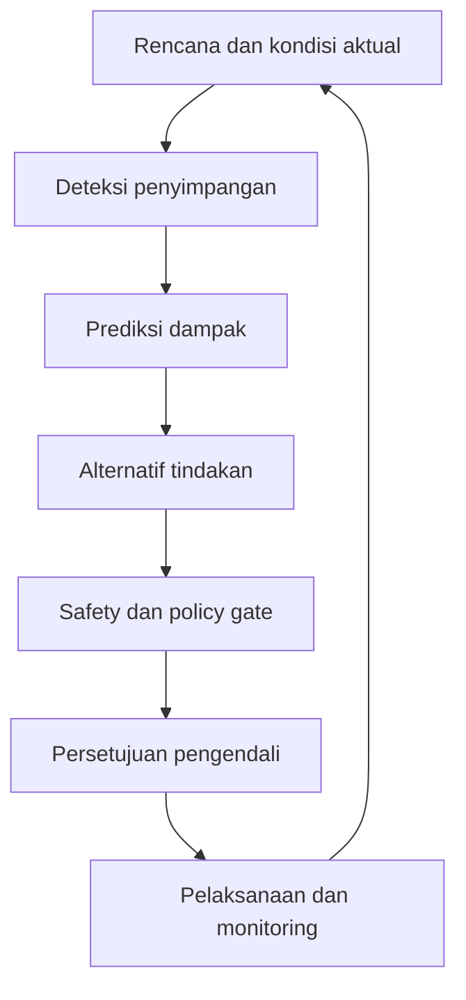

# Arsitektur Kawan Bus v0.1

> **Catatan pembaruan 26 Juli 2026:** prototipe aktif telah diarahkan ulang menjadi **Kawan Bus Pramusapa v0.2** untuk mendukung keselamatan dan keamanan, kenyamanan, serta informasi tanpa mengganggu pelayanan utama. Dokumen ini dipertahankan sebagai riwayat arsitektur konseptual awal. Lihat [Kawan Bus Pramusapa v0.2](kawan-bus-pramusapa-v0.2.md).

**Status:** Concept Architecture  
**Versi:** 0.1  
**Tanggal:** 26 Juli 2026  
**Inisiatif:** Transport Knowledge System Indonesia (TKSI)  
**Cakupan awal:** Layanan bus Transjakarta, dengan kandidat pilot Non-BRT/Transjabodetabek  

> Kawan Bus membantu pelanggan merencanakan dan menyelesaikan perjalanan, membantu pengendali mengambil keputusan operasi, serta membantu perencana membaca kebutuhan mobilitas kota—tanpa menggantikan kewenangan manusia.

## 1. Sasaran

Kawan Bus dirancang untuk menghasilkan tiga keluaran:

1. **Perjalanan yang dapat dipercaya:** pelanggan memahami rute, waktu, transit, gangguan, dan alternatif.
2. **Operasi yang responsif:** petugas memperoleh prediksi, peringatan, dan rekomendasi yang dapat dijelaskan.
3. **Kota yang lebih mudah diakses:** pola perjalanan agregat diterjemahkan menjadi masukan layanan, infrastruktur, dan tata ruang.

North Star Metric:

> Persentase perjalanan yang selesai dengan aman, informatif, dan membuat pelanggan bersedia menggunakan Transjakarta kembali.

## 2. Prinsip arsitektur

- **Customer-first:** keputusan dimulai dari kebutuhan tiba di tujuan, bukan hanya jumlah kendaraan atau kilometer.
- **Human-in-command:** rekomendasi tidak menjadi instruksi otomatis tanpa aturan dan persetujuan berwenang.
- **Safety before optimization:** keselamatan, kelaikan unit, dan batas kerja pramudi selalu menjadi kendala keras.
- **Explainable recommendation:** setiap rekomendasi menjelaskan masalah, dasar data, dampak, risiko, dan tingkat keyakinan.
- **Privacy by design:** data individu dikumpulkan seminimal mungkin, berdasarkan persetujuan, dan dapat dihapus.
- **One source of truth:** pelanggan, petugas, operator, dan manajemen membaca status layanan dari sumber yang konsisten.
- **Progressive delivery:** sistem berkembang dari simulasi, decision support, hingga otomasi terbatas yang tervalidasi.
- **Knowledge-linked:** rekomendasi dapat dijelaskan melalui Domain dan Knowledge Object TKSI.

## 3. Batas sistem

Kawan Bus memiliki tiga ruang produk dengan satu platform kecerdasan bersama.



### 3.1 Kawan Bus Pelanggan

- profil perjalanan berdasarkan persetujuan;
- perencanaan asal–tujuan;
- rekomendasi waktu berangkat;
- perbandingan pilihan perjalanan;
- navigasi ke titik naik;
- panduan transit dan pengingat turun;
- informasi gangguan dan alternatif;
- konfirmasi tiba dan umpan balik;
- penjelasan konsep melalui TKSI.

### 3.2 Kawan Bus Operasi

- prediksi permintaan;
- prediksi kebutuhan unit;
- kesiapan armada dan pramudi;
- monitoring headway, waktu tempuh, dan keterisian;
- proyeksi kilometer operator;
- rekomendasi unit cadangan;
- pengendalian gangguan;
- evaluasi hasil intervensi;
- dashboard petugas lapangan, pusat kendali, operator, dan manajemen.

### 3.3 Kawan Bus Kota

- peta asal–tujuan agregat;
- identifikasi wilayah kurang terlayani;
- analisis aksesibilitas;
- rekomendasi halte dan pengumpan;
- analisis simpul dan perpindahan;
- skenario jaringan dan tata guna lahan;
- masukan trotoar, penyeberangan, dan fasilitas;
- simulasi kebijakan melalui digital twin;
- partisipasi masyarakat yang dapat ditelusuri.

## 4. Lapisan arsitektur



### 4.1 Channel dan Experience

- portal web/PWA;
- percakapan virtual assistant;
- aplikasi petugas;
- dashboard operation control center;
- dashboard operator;
- dashboard perencana kota;
- notifikasi;
- kanal umpan balik.

### 4.2 Domain Services

- Customer Profile & Consent;
- Journey Planning;
- Service Information;
- Disruption & Recovery;
- Fleet Availability;
- Driver Availability;
- Dispatch Recommendation;
- Kilometer & Contract Control;
- Incident Management;
- Feedback & Case Management;
- Accessibility Analysis;
- Scenario Planning;
- Knowledge Recommendation.

### 4.3 Intelligence dan Decision Support

- demand forecasting;
- travel-time prediction;
- arrival prediction;
- crowding estimation;
- disruption detection;
- fleet requirement forecast;
- driver–vehicle matching;
- spare-unit allocation;
- headway control recommendation;
- remaining-kilometer projection;
- journey alternative ranking;
- service recovery recommendation;
- accessibility gap analysis;
- urban scenario evaluation.

### 4.4 Operational Data Platform

- katalog rute, stop, halte, pool, dan depot;
- jadwal dan rencana operasi;
- status unit;
- status pramudi;
- posisi kendaraan;
- realisasi perjalanan;
- headway dan waktu tempuh;
- transaksi atau jumlah pelanggan yang telah diagregasi;
- target serta realisasi kilometer;
- insiden dan gangguan;
- cuaca serta kegiatan khusus;
- umpan balik pelanggan;
- data tata guna lahan dan fasilitas publik.

### 4.5 Source Systems

- GTFS atau data jaringan setara;
- AVL/GPS;
- APC/AFC apabila tersedia dan diizinkan;
- fleet management;
- driver roster;
- maintenance management;
- operator contract and kilometer system;
- incident management;
- customer service;
- peta dan jaringan pejalan kaki;
- data kependudukan serta tata ruang yang sah.

## 5. Alur perjalanan pelanggan



## 6. Alur pengendalian operasi

1. Sistem membaca rencana operasi dan kondisi aktual.
2. Mesin deteksi mengidentifikasi penyimpangan.
3. Mesin prediksi menghitung dampak jika tidak ada tindakan.
4. Mesin rekomendasi membuat beberapa alternatif.
5. Policy engine menolak alternatif yang melanggar batas keras.
6. Pengendali melihat alasan, manfaat, risiko, dan proyeksi kilometer.
7. Pengendali menyetujui, mengubah, atau menolak.
8. Instruksi dikirim kepada pelaksana.
9. Sistem mengukur dampak dan menyimpan audit keputusan.



## 7. Mesin kebutuhan unit dan kilometer

### 7.1 Masukan

- permintaan per interval waktu;
- kapasitas per tipe kendaraan;
- target headway;
- cycle time;
- unit laik operasi;
- unit cadangan minimum;
- ketersediaan pramudi;
- batas jam kerja dan istirahat;
- lokasi unit serta pramudi;
- target kilometer operator;
- realisasi dan proyeksi kilometer;
- kebutuhan pemeliharaan;
- gangguan serta acara khusus.

### 7.2 Kendala keras

- unit harus laik;
- pramudi harus berwenang dan laik tugas;
- jam kerja dan istirahat tidak boleh dilanggar;
- cadangan minimum tetap tersedia;
- tipe kendaraan sesuai dengan rute;
- kapasitas jalan, halte, dan pool memungkinkan;
- tambahan kilometer tidak melampaui batas yang disetujui;
- tindakan tidak boleh menurunkan keselamatan.

### 7.3 Sasaran optimasi

Urutan prioritas:

1. keselamatan;
2. penyelesaian perjalanan pelanggan;
3. keandalan dan keteraturan;
4. pemerataan akses;
5. pemulihan gangguan;
6. pemanfaatan armada dan pramudi;
7. kepatuhan target kilometer;
8. efisiensi biaya.

### 7.4 Perhitungan dasar

```text
Sisa kapasitas km
= target km harian
- proyeksi km operasi reguler
- cadangan km gangguan
- tambahan km yang sudah disetujui
```

Rekomendasi tambahan unit hanya diterbitkan apabila:

```text
manfaat pelayanan terukur
AND unit laik tersedia
AND pramudi laik tersedia
AND cadangan minimum aman
AND tambahan km <= sisa kapasitas km
```

## 8. Bentuk rekomendasi operasi

Setiap rekomendasi wajib memuat:

- masalah yang terdeteksi;
- waktu dan lokasi;
- data aktual;
- proyeksi tanpa tindakan;
- tindakan yang disarankan;
- unit dan pramudi yang terlibat;
- dampak terhadap pelanggan;
- dampak terhadap headway dan kapasitas;
- tambahan serta sisa kilometer;
- risiko;
- tingkat keyakinan;
- masa berlaku rekomendasi;
- pihak yang harus menyetujui;
- hasil setelah tindakan.

## 9. Arsitektur data minimum

Entitas inti:

| Entitas | Fungsi |
|---|---|
| CustomerPreference | Pilihan perjalanan berdasarkan persetujuan |
| Journey | Rencana perjalanan pelanggan |
| Route | Identitas dan pola rute |
| Stop | Titik naik, turun, dan transit |
| Trip | Perjalanan terjadwal atau aktual |
| Vehicle | Unit dan status kelaikan |
| Driver | Pramudi, kewenangan, dan kesiapan |
| Operator | Penyedia layanan dan batas kontraktual |
| Assignment | Penugasan unit–pramudi–rute |
| KilometerLedger | Target, realisasi, proyeksi, dan sisa km |
| ServiceObservation | Headway, waktu tempuh, keterisian |
| Incident | Gangguan dan dampaknya |
| Recommendation | Alternatif tindakan dan alasan |
| Decision | Persetujuan, perubahan, atau penolakan |
| Feedback | Pengalaman pelanggan |
| KnowledgeObject | Penjelasan konsep TKSI |
| UrbanZone | Wilayah analisis aksesibilitas |
| Scenario | Skenario operasi atau tata ruang |

## 10. Event penting

- JourneyRequested
- JourneyStarted
- TransferApproaching
- JourneyCompleted
- ServiceDisruptionDetected
- HeadwayDeviationDetected
- VehicleUnavailable
- DriverUnavailable
- SpareUnitRecommended
- DispatchDecisionApproved
- KilometerThresholdApproaching
- CustomerFeedbackSubmitted
- AccessibilityGapDetected
- UrbanScenarioEvaluated

Event menggunakan waktu, lokasi, sumber, kualitas data, dan correlation ID agar alur keputusan dapat diaudit.

## 11. Hak akses

| Peran | Akses utama |
|---|---|
| Pelanggan | Perjalanan dan preferensi miliknya |
| Petugas lapangan | Kondisi serta instruksi pada wilayah tugas |
| Pengatur armada | Unit, alokasi, dan cadangan |
| Pengatur pramudi | Jadwal, kesiapan, dan batas kerja |
| Pengendali | Rekomendasi dan persetujuan operasi |
| Operator | Armada, kilometer, dan kinerja miliknya |
| Manajemen | Kinerja agregat dan audit |
| Perencana | Data agregat dan skenario kota |
| Administrator | Konfigurasi, bukan keputusan operasi |
| Auditor | Riwayat data, rekomendasi, dan keputusan |

Tidak ada peran yang memperoleh seluruh data tanpa kebutuhan yang sah.

## 12. Privasi dan keselamatan

- preferensi pelanggan bersifat opt-in;
- lokasi presisi tidak disimpan lebih lama dari kebutuhan perjalanan;
- analisis kota menggunakan agregasi dan ambang minimum;
- data pramudi tidak ditampilkan kepada pelanggan;
- keputusan keselamatan tidak diotomatisasi pada MVP;
- rekomendasi kedaluwarsa otomatis ketika kondisi berubah;
- semua perubahan instruksi dicatat;
- sumber dan kualitas data ditampilkan;
- sistem memiliki mode operasi terdegradasi ketika data real-time gagal;
- rekomendasi tidak boleh mengklaim kepastian yang tidak didukung data.

## 13. Integrasi dengan TKSI

Kawan Bus menjadi use case lintas Domain:

- **D01:** mobilitas, aksesibilitas, perjalanan, sistem;
- **D02:** permintaan, perencanaan, tata guna lahan;
- **D03:** angkutan umum, integrasi, kualitas pelayanan;
- **D04:** headway, dispatching, reliability, incident;
- **D05:** AVL, data, AI, digital twin, governance;
- **D06:** JUTPI, Transjakarta, Transjabodetabek;
- **D07:** command center, analytics, PERMATA, decision intelligence.

Setiap rekomendasi dapat menyediakan tautan **Mengapa rekomendasi ini diberikan?** menuju KO yang relevan.

## 14. MVP yang direkomendasikan

MVP tidak langsung mengendalikan operasi. Fokus pada satu pilot dan tiga pengalaman.

### 14.1 Pelanggan

- pilih asal, tujuan, dan waktu tiba;
- tampilkan rencana perjalanan berbasis skenario;
- tampilkan alasan rekomendasi;
- simulasi gangguan dan alternatif;
- simpan preferensi secara lokal;
- umpan balik setelah perjalanan.

### 14.2 Operasi

- impor rencana operasi;
- input unit dan pramudi tersedia;
- input target kilometer operator;
- proyeksi kebutuhan unit;
- proyeksi realisasi dan sisa kilometer;
- rekomendasi penambahan unit;
- approval manual;
- audit keputusan.

### 14.3 Kota

- peta titik asal–tujuan agregat;
- peta titik layanan dan gap akses;
- simulasi sederhana penambahan stop atau pengumpan;
- perbandingan indikator sebelum–sesudah.

## 15. Kandidat pilot

Pilot dipilih menggunakan kriteria:

- pola permintaan terlihat;
- terdapat isu keandalan atau akses;
- data rencana dan realisasi dapat diperoleh;
- operator serta petugas bersedia terlibat;
- jumlah rute dibatasi;
- perjalanan memiliki titik transit atau last-mile yang bermakna;
- manfaat pelanggan dapat diukur.

Fokus Non-BRT/Transjabodetabek sesuai arah TKSI. Rute P11 dapat menjadi kandidat, tetapi penetapan pilot memerlukan konfirmasi data dan pemilik proses.

## 16. Tahapan implementasi

### Fase 0 — Concept validation

- validasi problem statement;
- wawancara pelanggan, petugas, pengendali, dan operator;
- petakan customer journey dan operational journey;
- definisikan baseline;
- tetapkan rute pilot.

### Fase 1 — Simulated decision support

- prototipe interaktif;
- data manual atau batch;
- rekomendasi berbasis aturan;
- approval manusia;
- tidak ada kontrol langsung.

### Fase 2 — Integrated pilot

- integrasi jadwal, posisi, armada, pramudi, dan kilometer;
- prediksi dasar;
- notifikasi;
- dashboard peran;
- evaluasi dampak.

### Fase 3 — Predictive operation

- demand forecasting;
- arrival dan travel-time prediction;
- optimasi unit;
- service recovery;
- digital twin operasi.

### Fase 4 — Urban mobility intelligence

- data agregat lintas perjalanan;
- accessibility planning;
- skenario jaringan dan tata ruang;
- partisipasi masyarakat;
- evaluasi kebijakan.

### Fase 5 — Controlled automation

- otomasi terbatas untuk aturan berisiko rendah;
- policy gate;
- kill switch;
- monitoring bias dan drift;
- audit independen.

## 17. Keputusan yang masih terbuka

1. Siapa pemilik produk dan pemilik keputusan operasi?
2. Rute mana yang menjadi pilot?
3. Data apa yang tersedia dan berapa kualitasnya?
4. Apakah target kilometer merupakan target, batas maksimum, atau kombinasi kontraktual lain?
5. Siapa yang berwenang menyetujui penambahan unit?
6. Bagaimana struktur operator dan kontraknya direpresentasikan?
7. Kanal pelanggan apa yang digunakan terlebih dahulu?
8. Apakah prototipe awal berdiri sebagai inisiatif independen TKSI atau bekerja sama dengan pihak resmi?
9. Baseline dan target pelayanan apa yang disepakati?
10. Data apa yang tidak boleh masuk ke sistem?

## 18. Gerbang menuju desain rinci

Arsitektur v0.1 dapat dilanjutkan menjadi desain rinci setelah tersedia:

- satu persona pelanggan utama;
- satu perjalanan prioritas;
- satu rute pilot;
- satu masalah operasional prioritas;
- pemilik proses;
- daftar data yang benar-benar tersedia;
- baseline kinerja;
- batas keputusan yang disetujui.
